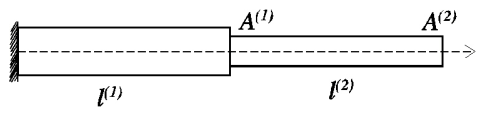

# Multi-bar system stress analysis

This work is my practical assignment to find a stress of multi-bar
system. In this assignment, I used Finite Element Method to solve 
the multi-bar system.

## Authors

- [Le Dinh Tan](https://github.com/ledinhtan)

## Problem

Find stress distribution in the axially symmetrical bar system
(Attached figure below) subjected to fix one end, other end is pulled by the 
axial force p = 1 kg. The geometric parameters: Cross-section A1 =
2 cm^2, A2 = 1 cm^2, l1 = l2 = 10 cm. Young's mmodulus E1 = E2 = E =
2x10^6 kg/cm^2. 

## Numerical Results

Running the code to see the numerical results.

The displacement is shown by the following table:

| Node | Displacement |
| :--  | :----------- |
|  1   |      0       |
|  2   |   2.5x10^9   |
|  3   |   7.5x10^9   |

The following table illustrates the stress each element

| Element | Stress |
|  :----  | :----- |
|   1     |  500   |
|   2     |  1000  |

## Programming Language

**Programming language:** Python

**Version:** 3.9.7
